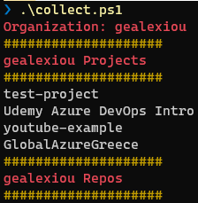

# Azure DevOps inventory
Azure DevOps inventory script that uses ADO REST API to gather information for projects, pipelines, agents, repositories.


## How to use

In order to execute the powershell you will need to change first the `ORG_NAME` and `TOKEN` that are located inside the **src/collect.ps1**  
If you have more than one organizations for which you need to gather information, you will need to change the `table` as shown below.

```
$organizations= @(
    @{name="ORG_NAME";token="TOKEN"},
    @{name="ORG2";token="TOKEN2"}
)
```


## Execution

Create a Personal Access Token and input this value inside the powershell. Run `collect.ps1` and get the output on the command line.



## Functions
The existing functions for the inventory


| Powershell Function | Description |
| --- | --- |
| Get-Projects-Within-Org | Get projects within an Azure DevOps organization |
| Get-Repos-Within-Org | Get repositories within an Azure DevOps organization |
| Get-Repos-PerProject-Within-Org | Get repositories per project within an Azure DevOps organization |
| Get-Agentpools-Within-Org | Get agentpools within an Azure DevOps organization |
| Get-Agents-Within-Org | Get agents within an Azure DevOps organization |
| Get-Pipelines-Within-Org | Get pipelines within an Azure DevOps organization |
